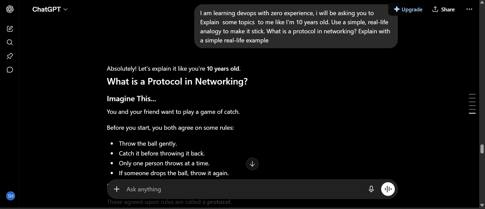
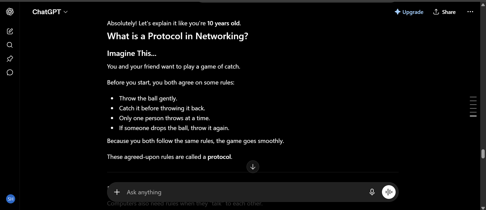
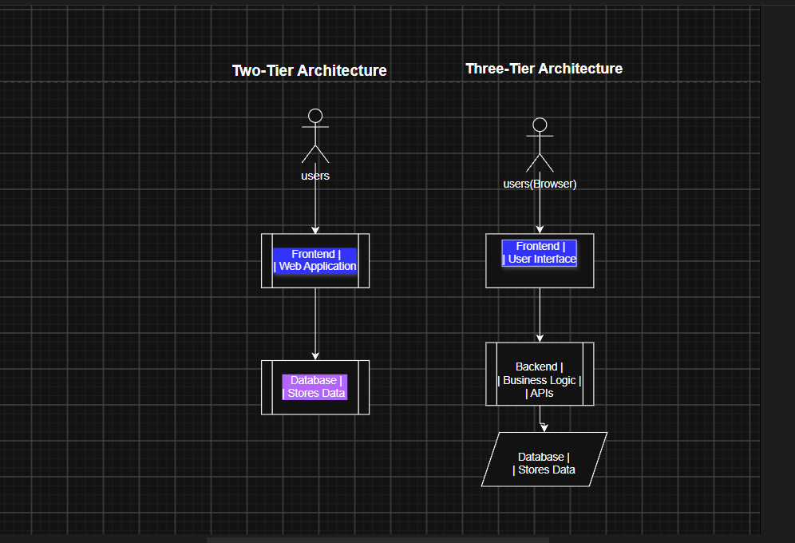
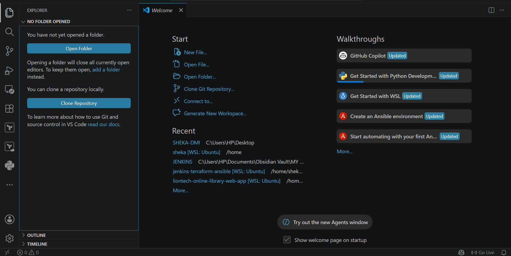
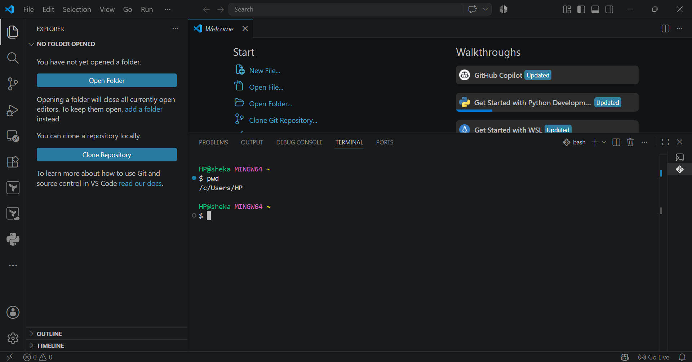

# Week 00 - Internet and Networking

Part of the DevOps Micro Internship (DMI) Cohort 3 with Agentic AI

---

# 🧑‍💻 Task 1: Using ChatGPT as Your Learning Assistant

## Scenario

You're new to DevOps and will frequently encounter technical questions. ChatGPT can be your learning companion.

## Your Task

Write a clear ChatGPT prompt to help you understand:

> "What is a protocol in networking? Explain with a simple real-life example."

Take a screenshot of your interaction showing:

* Your detailed prompt (with clear expectations)
* ChatGPT's simplified response with an example

## Screenshot






---

## What I Learned (2–3 lines)

From this task, I learned that writing an effective ChatGPT prompt starts with clearly describing my current knowledge level, such as being a beginner in DevOps. I also learned that specifying the type of response I want such as simple English, step-by-step explanations, or real-world examples helps ChatGPT provide more accurate, personalized, and easy-to-understand answers.


---

# 🌐 Task 2: Internet and Networking

## Scenario

Your friend is launching an online bookstore named **EpicReads**.

He asked you to explain how users globally can access his website hosted in Finland.

## Your Task

Write a short explanation (**100–150 words**) that includes:

* Packet Switching
* IP Address
* TCP/IP
* HTTP/HTTPS


## Answer

When a user anywhere in the world visits **EpicReads**, they type the website address into their browser. The browser sends a request using **HTTP** or the secure version **HTTPS** to ask the server in **Finland** for the bookstore's web pages. The server is identified by its unique **IP Address**, which works like a home address so data reaches the correct destination. The request and response travel across the internet using the **TCP/IP** protocol suite. **TCP** ensures that all pieces of data arrive correctly and in the right order, while **IP** handles the routing of the data to the correct location. The data is sent using **Packet Switching**, where it is divided into small packets that travel through different network paths before being reassembled on the user's device to display the EpicReads website.


---

# 🏗️ Task 3: Application Architecture & Stack

## Scenario

EpicReads bookstore has two application versions:

### Two-Tier Application

* Frontend
* Database

### Three-Tier Application

* Frontend
* Backend
* Database

## Your Task

* Draw simple diagrams (hand-drawn or tool-based such as draw.io)
* Label each layer clearly
* List at least two common technologies or tools used for each layer
* Submit a screenshot or photo clearly showing your own drawing

## Diagram Screenshot / Photo





---

## Technologies Used

### Frontend

* HTML/CSS
* React

### Backend

* Java (Spring Boot)
* Node.js (Express)

### Database

* PostgreSQL
* MySQL

---

# 🌍 Task 4: Domain Name & DNS (Basic Concepts)

## Scenario

Your friend's bookstore **EpicReads** is currently accessible through:

```text
52.172.142.222:3000
```

He purchased the domain:

```text
epicreads.com
```

## Your Task

In **50–100 words**, explain in your own words:

1. What is DNS (Domain Name System)?
2. Which DNS record type should be used to connect the domain to the given IP, and why?

## Answer

The **Domain Name System (DNS)** is like the internet's phonebook. It translates easy-to-remember domain names, such as **epicreads.com**, into numerical **IP Address** values that computers use to find servers. To connect **epicreads.com** to **52.172.142.222**, an **A Record** should be used because it maps a domain name directly to an IPv4 address. This allows users to access the EpicReads website using its domain name instead of typing the server's IP address.


---

# 💻 Task 5: Visual Studio Code Setup (Hands-on)

## Your Task

Install Visual Studio Code (if not already installed).

Take a screenshot of your VS Code environment showing:

* Terminal open inside VS Code
* Running a basic command:

### Windows

```powershell
dir
```

### Linux / macOS

```bash
pwd
ls
```

* Your selected VS Code theme clearly visible

⚠️ **Important:** The screenshot must show your username or another identifiable detail to confirm it is your environment.

## Screenshot






---

# 🔗 Task 6: Publish Your Assignment as a LinkedIn Post

## Objective

Publishing on LinkedIn helps you:

* Build your professional online presence
* Reinforce your learning
* Document your DevOps journey publicly

## Your Task

Summarize your answers from Tasks 1–5 into a LinkedIn post.

Clearly structure your post into the following sections:

* ChatGPT
* Internet & Networking
* App Architecture
* DNS
* VS Code Setup

Add the following credit note at the end of your post:

> **P.S. This post is part of the DevOps Micro Internship (DMI) with Agentic AI — Cohort 3 — by Pravin Mishra. My graded progress is public: https://dmi.pravinmishra.com/s/shekahassan.html · Start your DevOps journey: https://dmi.pravinmishra.com/?utm_source=student&utm_medium=ps-linkedin&utm_campaign=cohort3**

---

## LinkedIn Post URL

Paste your LinkedIn post URL here:


[Add your URL here...](https://www.linkedin.com/posts/shekahassankargbo_devops-networking-softwarearchitecture-share-7489068482567979008-FqxC/?utm_source=share&utm_medium=member_desktop&rcm=ACoAAGROQiABjU7JQZeMJnx30MgL4nzL7kZXtVE)


## LinkedIn Post Backup Copy


 My DevOps Learning Journey – Week 1
I'm currently learning DevOps from scratch again, and this week I focused on understanding some of the core concepts that make modern applications and the internet work.
🤖 ChatGPT
One of the most valuable learning tools I've used is ChatGPT. It helps me break down complex DevOps and networking concepts into simple explanations, practical examples, and real-world analogies, making it much easier to build a strong foundation.
🌐 Internet & Networking
I learned how users anywhere in the world can access a website hosted in another country. When someone visits a website, their browser sends a request using HTTP/HTTPS. The data travels across the internet using the TCP/IP protocol suite, while Packet Switching divides the data into smaller packets that can travel through different routes before being reassembled. Every server has a unique IP address, allowing requests to reach the correct destination.
🏗️ App Architecture
I explored two common application architectures:
Two-Tier Architecture
Frontend
Database
The frontend communicates directly with the database. This design is simple and suitable for smaller applications.
Three-Tier Architecture
Frontend
Backend
Database
The backend sits between the frontend and the database, handling business logic, security, and API requests. This architecture is more scalable, secure, and easier to maintain.
🌍 DNS
I also learned about the Domain Name System (DNS), which works like the internet's phonebook. DNS converts human-friendly domain names into IP addresses that computers understand. For a website like epicreads.com, an A Record is used to point the domain to its IPv4 server address, allowing users to access the website using its name instead of a numeric IP.
💻 VS Code Setup
I set up Visual Studio Code as my primary development environment. With useful extensions, an integrated terminal, Git support, and debugging tools, VS Code provides everything needed to begin learning Linux, Git, scripting, and other DevOps technologies.
Every topic I learn strengthens my understanding of how applications are built, deployed, and accessed across the internet. Looking forward to learning more as I continue this DevOps journey!
#DevOps #Networking #VSCode #CloudComputing #LearningInPublic #CareerGrowth #TechLearning
P.S. This post is part of the DevOps Micro Internship (DMI) with Agentic AI — Cohort 3 — by Pravin Mishra. My graded progress is public: https://dmi.pravinmishra.com/s/shekahassan.html · Start your DevOps journey: https://dmi.pravinmishra.com/?utm_source=student&utm_medium=ps-linkedin&utm_campaign=cohort3


---

# Reflection – Week 0

### What did you find easy?

breaking down difficult concept using chatgpt helps a lot.

---

### What was difficult?

Learning new concept and navigating between the two tier and the three tier apllication

---

### What will you improve next week?

Next week, I will improve by spending more time practising the concepts to gain better understanding.

---

## 📌 About DMI & CloudAdvisory

DevOps Micro Internship (DMI) is a project-based DevOps program run by Pravin Mishra (The CloudAdvisory) focused on real-world execution, systems thinking, and career readiness.

It helps learners build strong DevOps foundations with hands-on experience.


## 📌 Resources

- 🌐 **DMI Official Website:** https://dmi.pravinmishra.com?utm_source=github&utm_medium=readme  
- 🎓 **University:** https://university.pravinmishra.com?utm_source=github&utm_medium=readme  
- 💬 **Discord Community:** https://discord.pravinmishra.com?utm_source=github&utm_medium=readme  
- 📝 **Blog:** https://dmi.pravinmishra.com/blog?utm_source=github&utm_medium=readme  
- ▶️ **YouTube Playlist (DMI Cohort 3):** https://www.youtube.com/playlist?list=PLFeSNDtI4Cho  
- 🔗 **Pravin Mishra (LinkedIn):** https://www.linkedin.com/in/pravin-mishra-aws-trainer/  
- 🏢 **CloudAdvisory (LinkedIn):** https://www.linkedin.com/company/thecloudadvisory/

---

*This submission is part of DevOps Micro Internship (DMI) Cohort 3 — Agentic AI Track*
