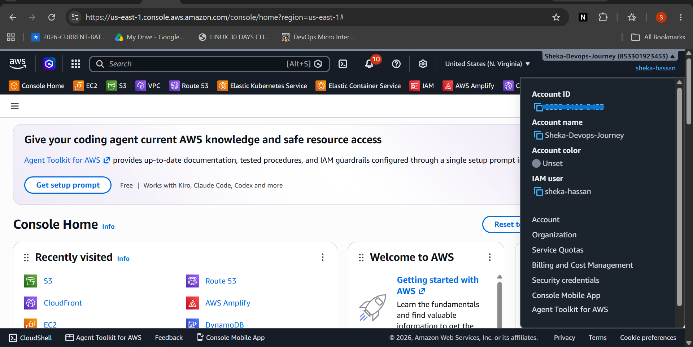

# Assignment 1 — AWS Free Tier Account Setup (EpicReads Cloud Onboarding)

Part of the DevOps Micro Internship (DMI) Cohort 3 with Agentic AI

---

## Purpose

In this assignment, you will create and verify an AWS Free Tier account as part of onboarding EpicReads — an online bookstore moving to the cloud. You will demonstrate an understanding of AWS fundamentals, Free Tier services, and account setup by answering conceptual questions and capturing proof of a working AWS Console login.

---

# Task 1 — Understanding AWS & Free Tier

## Goal

Demonstrate understanding of AWS basics and Free Tier usage by answering the following questions in your own words (3–4 lines each).

### Answers

#### Question 1 — What is an AWS account, and why do you need it at this stage?

An AWS account is your personal used to access and manage AWS cloud services at this stage, I need an AWS account so I can practice deploying and managing cloud infrastructure and Aws services such as EC2, S3, IAM, and VPC while learning DevOps in a real cloud environment.It also gives me hands-on experience with AWS before working with production infrastructure.

---

#### Question 2 — What is AWS Free Tier, and how long does it last?

AWS Free Tier provides limited free usage of selected AWS services so beginners can learn and experiment without paying the normal service price. The duration depends on the specific service and offer: some Free Tier offers are available for 6 months, while others are always free or are short-term trials.I still need to monitor my usage because exceeding the free limits can result in charges.

---

#### Question 3 — Name three AWS Free Tier services and their free usage limits.

Three examples are:

1. Amazon EC2 = eligible new customers can receive up to 750 hours/month of certain eligible instance types for 12 months.
2. Amazon S3 = eligible new customers can receive 5 GB of standard storage for 6 months.
3. AWS Lambda = includes 1 million free requests/month and 400,000 GB-seconds of compute time/month under the always-free tier.
 AWS Free Tier offers and limits can change, and eligibility can depend on when the AWS account was created. Always check the current AWS Free Tier page before deploying resources.

---

# Task 2 — Create AWS Free Tier Account

## Goal

Create a valid AWS Free Tier account and sign in to the AWS Management Console.

> No screenshots required for this task. Completion is verified through Task 3.

---

# Task 3 — Verify AWS Account

## Goal

Confirm that your AWS account setup is complete by navigating to the Account section and capturing proof.

### Evidence

#### Screenshot 1 — AWS Account page showing account name (email may be blurred)

---

# Submission Instructions

- Add all required screenshots in your GitHub repository submission
- Full name must be visible in required screenshots
- Do not expose sensitive information (keys, passwords, account IDs)

---

# Completion Checklist

- [ ] Task 1 answers written in own words
- [ ] AWS Free Tier account created successfully
- [ ] Signed in to AWS Management Console
- [ ] Screenshot of AWS Account page captured (full name visible, no sensitive data)
- [ ] All required screenshots added to repository

---

## 📌 About DMI & CloudAdvisory

DevOps Micro Internship (DMI) is a project-based DevOps program run by Pravin Mishra (The CloudAdvisory) focused on real-world execution, systems thinking, and career readiness.

It helps learners build strong DevOps foundations with hands-on experience.

---

## 📌 Resources

- 🌐 DMI Official Website: https://dmi.pravinmishra.com?utm_source=github&utm_medium=readme  
- 🎓 University: https://university.pravinmishra.com?utm_source=github&utm_medium=readme  
- 💬 Discord Community: https://discord.pravinmishra.com?utm_source=github&utm_medium=readme  
- 📝 Blog: https://dmi.pravinmishra.com/blog?utm_source=github&utm_medium=readme  
- ▶️ YouTube Playlist: https://www.youtube.com/playlist?list=PLFeSNDtI4Cho  
- 🔗 Pravin Mishra (LinkedIn): https://www.linkedin.com/in/pravin-mishra-aws-trainer/  
- 🏢 CloudAdvisory (LinkedIn): https://www.linkedin.com/company/thecloudadvisory/

---

*This submission is part of DevOps Micro Internship (DMI) Cohort 3 — Agentic AI Track.*