# Assignment 5 — Bash Script Automation Drill (OPS Checklist)

Part of the DevOps Micro Internship (DMI) Cohort 3 with Agentic AI

---

## Purpose

In this assignment, you will practice Bash scripting by building a series of small automation scripts covering environment setup, variables, arrays, loops, file conditionals, if-else logic, and functions. These scripts form the foundation of real-world Linux automation used in DevOps, cloud, and production support environments.

---

# Task 1 — Bash Environment & Workspace Setup

## Goal

Verify that Bash is available on your system and create a clean workspace for this assignment.

### Evidence

#### Screenshot 1 — Output of `echo $SHELL` and `bash --version`

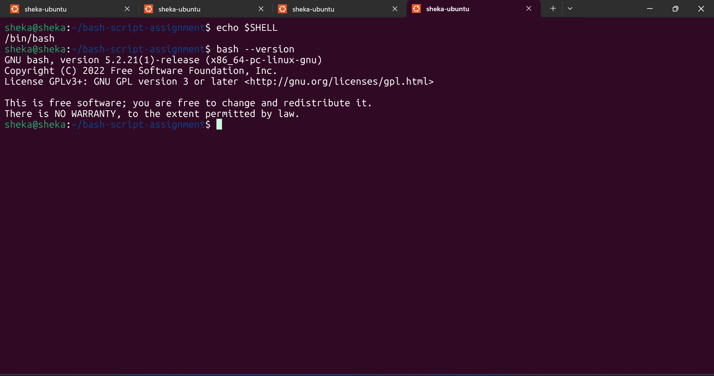

---

#### Screenshot 2 — Output of `pwd` and `ls -lah` showing the scripts directory

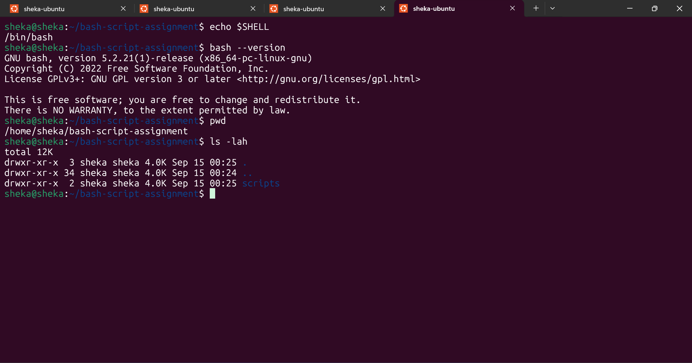

---

### Notes

Answer the following in your own words:

**1. What is Bash?**

Bash is a type of program that helps you communicate with your computer operating system. It acts as a translator between you and your computer.

---

**2. What is the difference between shell and Bash?**

A shell is a general term for a program that allows you to communicate with an operating system using human-readable commands.
Bash is one type of shell.

---

**3. Why is it important to confirm the Bash version before writing scripts?**

It is important to check the bash version because some features that work well in newer versions may not work perfectly on another machine with older versions.

---

# Task 2 — Your First Bash Script

## Goal

Create your first Bash script, make it executable, and run it from the terminal.

### Evidence

#### Screenshot 1 — Content of `first-script.sh`

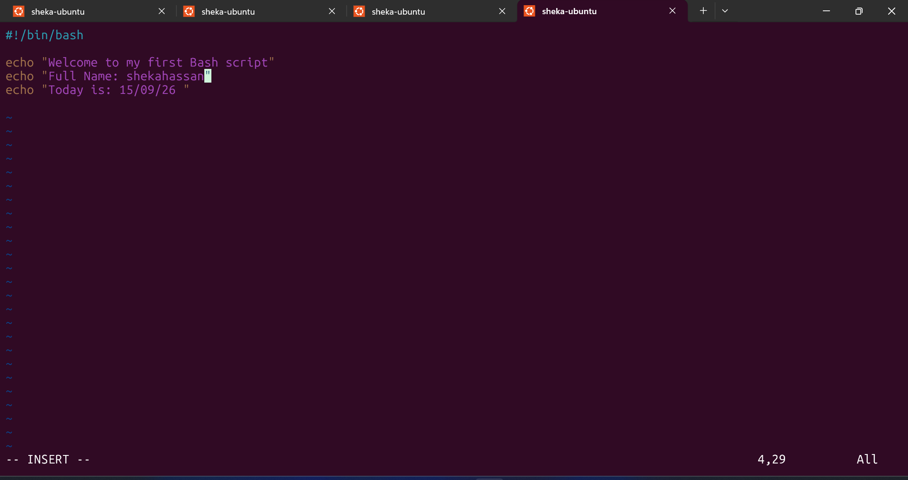

---

#### Screenshot 2 — Output of `./first-script.sh`

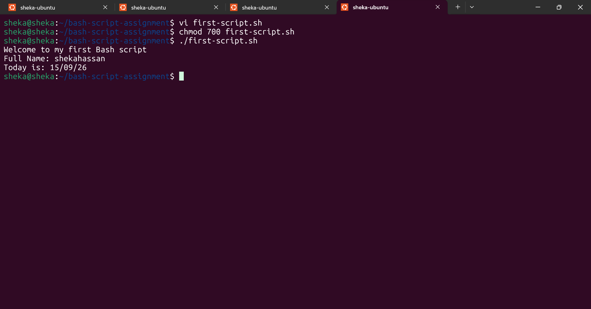

---

#### Screenshot 3 — Output of `ls -l first-script.sh` showing executable permission

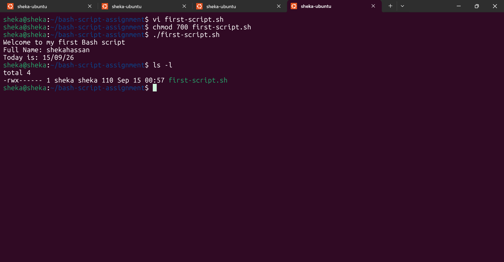
---

### Notes

Answer the following in your own words:

**1. What is the purpose of `#!/bin/bash`?**

It tells Linux to use this particular type of shell i.e bash to run the script.

---

**2. Why do we use `chmod +x` before running a script?**

When creating a shell script, linux may not give it permission to be executed by default. So you have to run chmod +x to give it executable permisssions.

---

**3. What is the difference between running a script using `./script.sh` and `bash script.sh`?**

Linux runs the file directly and follows the shebang by using bash to run the script
While Bash script.sh tells bash directly to run the script.

---

# Task 3 — Variables: User Information Script

## Goal

Use variables to store and display user-related information.

### Evidence

#### Screenshot 1 — Content of `user-info.sh`

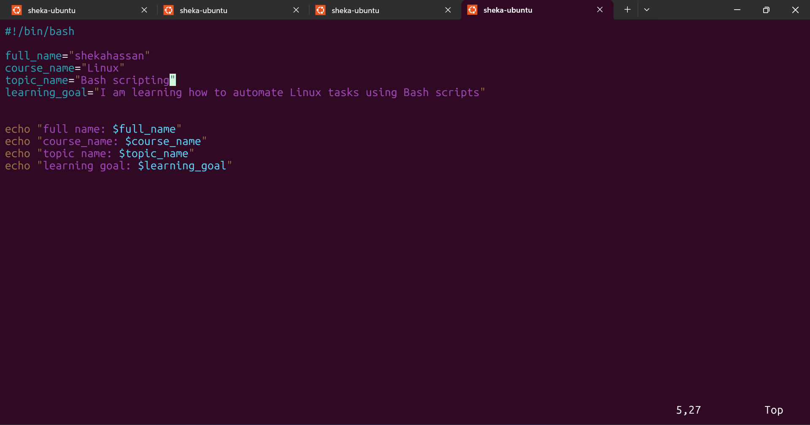

---

#### Screenshot 2 — Output of `./user-info.sh`

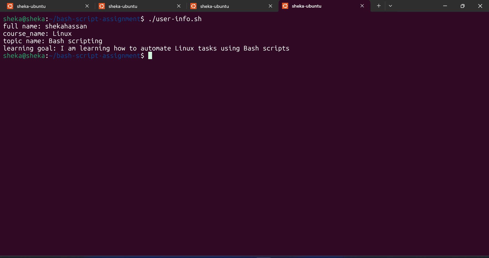

---

### Notes

Answer the following in your own words:

**1. What is a variable in Bash?**

Variable is like a box with a label that stores values/information that you can use later.

---

**2. Why should we avoid spaces around the `=` sign when creating variables?**

Because Bash treats spaces as separators between different commands or arguments. 

---

**3. How do you access the value stored inside a Bash variable?**

Use the $ sign before the variable name. 
The $ basically means:
"Give me what's inside this box."

---

# Task 4 — Arrays & Loops: Tools Checklist Script

## Goal

Use arrays and loops to print a checklist of tools used in Bash scripting.

### Evidence

#### Screenshot 1 — Content of `tools-checklist.sh`

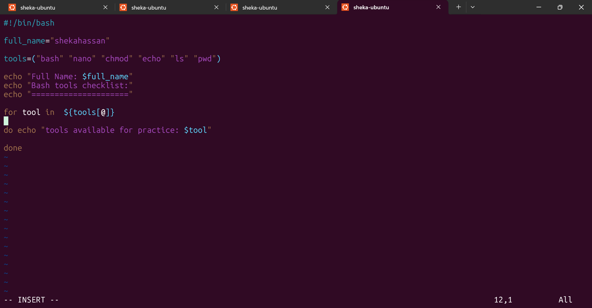

---

#### Screenshot 2 — Output of `./tools-checklist.sh`

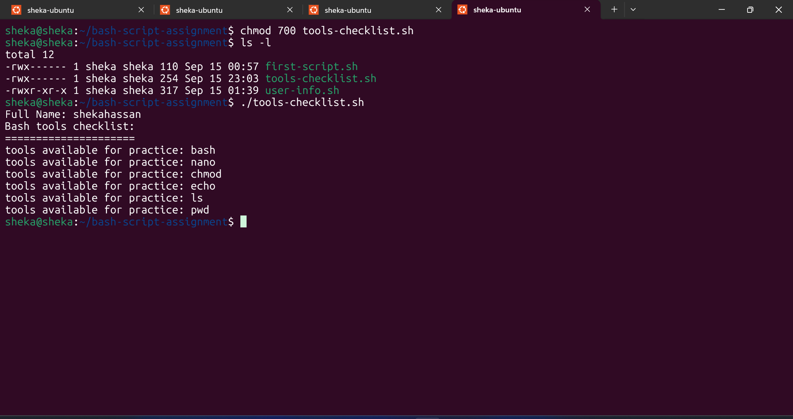

---

### Notes

Answer the following in your own words:

**1. What is an array in Bash?**

Arrays in Bash act just like variables to store multiple values instead of one.

---

**2. Why are arrays useful in scripts?**

Arrays are useful when you need to work with a group of related things. Instead of writing separate code for every tool, you can write one piece of code that works with the entire array.  

---

**3. What does `"${tools[@]}"` mean?**

It means give me all the individual items stored in this particular array. The @ means all items. 

---

**4. What is the purpose of the `for` loop in this script?**

A for loop allows you to repeat the same action for each item in a list or array. 

---

# Task 5 — Loops: Number Counter Script

## Goal

Use loops to repeat a task multiple times.

### Evidence

#### Screenshot 1 — Content of `counter.sh`

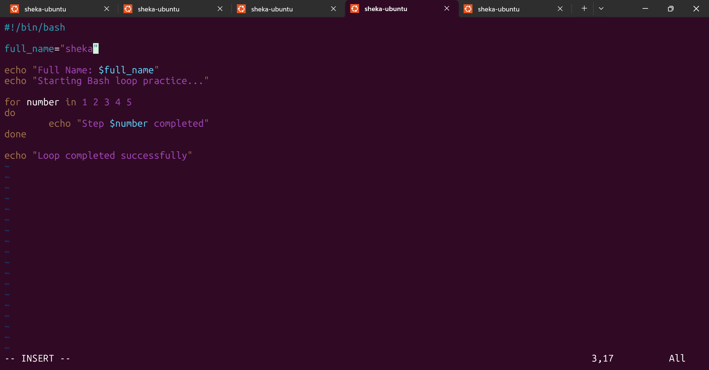

---

#### Screenshot 2 — Output of `./counter.sh`

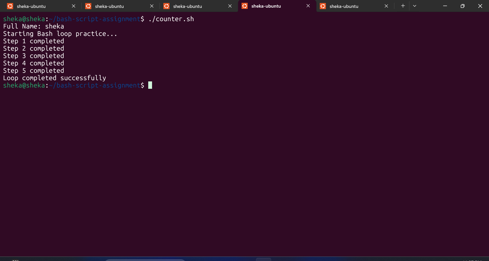

---

### Notes

Answer the following in your own words:

**1. What is a loop?**

A loop is a way to tell the computer to do the same thing again and again.

---

**2. Why do we use loops in Bash scripting?**

Loops save us from writing the same code repeatedly. 

---

**3. How many times did the loop run in your script?**

the loop ran 5 times
because the loop has five values.

---

**4. What would you change if you wanted the loop to run 10 times?**

Add your answer here.

---

# Task 6 — Files & Conditionals: File Validation Script

## Goal

Use file checks and conditionals to verify whether files and directories exist.

### Evidence

#### Screenshot 1 — Output of `ls -lah ../test-folder`

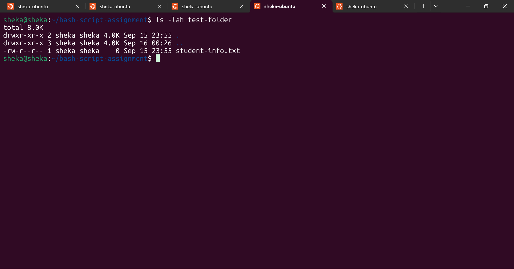

---

#### Screenshot 2 — Content of `file-check.sh`

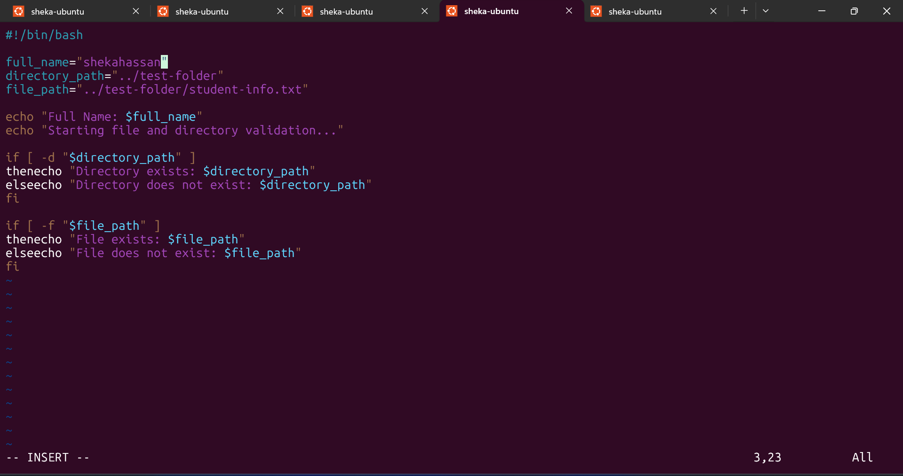

---

#### Screenshot 3 — Output of `./file-check.sh`

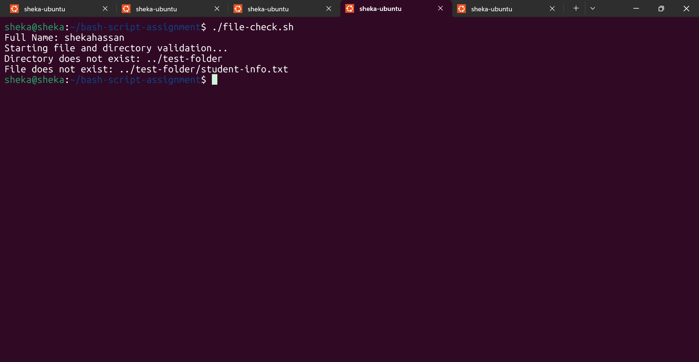

---

### Notes

Answer the following in your own words:

**1. What does `-d` check in Bash?**

-d checks whether something is a directory (folder). 

---

**2. What does `-f` check in Bash?**

-f checks whether something is a regular file.

---

**3. Why should file and directory paths be stored in variables?**

Instead of repeatedly writing a long path, you can store it in a variable.

---

**4. What happens if the file does not exist?**

If you check,and the file doesn't exist, the -f test becomes false.
Bash then runs the else section.

---

# Task 7 — Conditionals: Pass or Retry Script

## Goal

Use if-else conditionals to make decisions based on a variable value.

### Evidence

#### Screenshot 1 — Content of `score-check.sh` with `score=85`

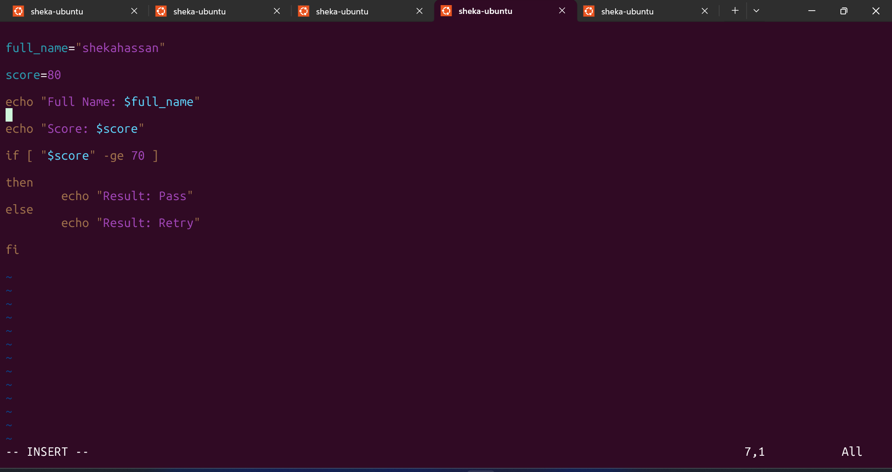

---

#### Screenshot 2 — Output showing `Result: Pass`

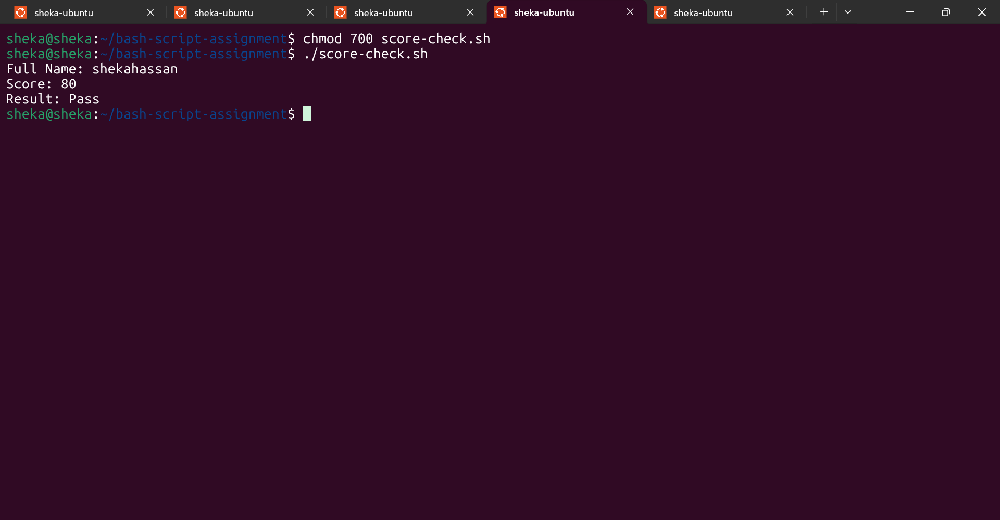

---

#### Screenshot 3 — Content of `score-check.sh` with `score=55`

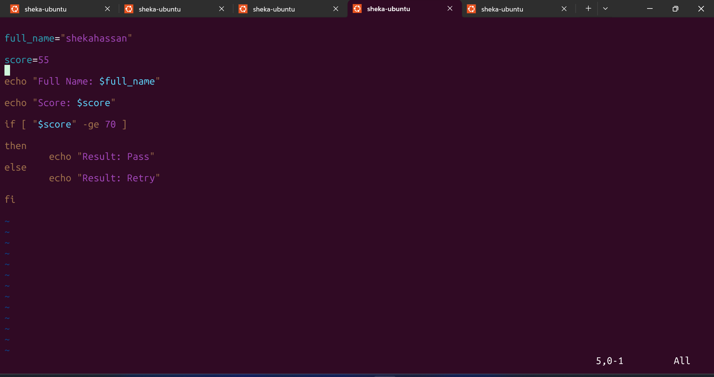

---

#### Screenshot 4 — Output showing `Result: Retry`

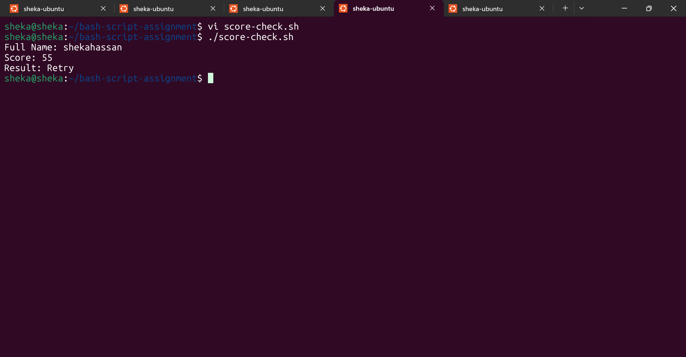
---

### Notes

Answer the following in your own words:

**1. What is the purpose of if-else in Bash?**

if-else allows a script to make decisions. 

---

**2. What does `-ge` mean?**

-ge means:
Greater than or equal to

---

**3. Why should conditions be tested with different values?**

Because you want to make sure your script makes the correct decision in different situations.

---

**4. How can conditionals help in automation scripts?**

conditionals allow scripts to respond automatically to different system states instead of blindly executing the same commands every time. 

---

# Task 8 — Functions: Final Bash Automation Script

## Goal

Create a final Bash script using functions to organize reusable code.

### Evidence

#### Screenshot 1 — Content of `final-automation.sh`

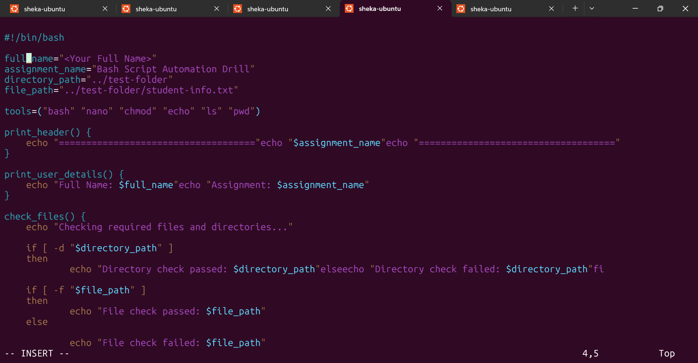

---

#### Screenshot 2 — Output of `./final-automation.sh`

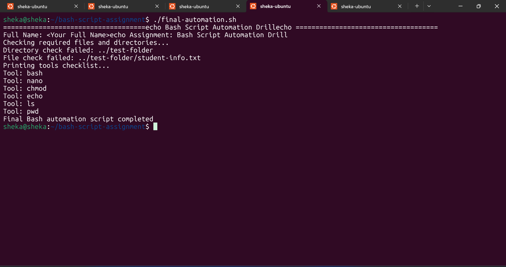

---

#### Screenshot 3 — Output of `ls -lah` showing all created scripts

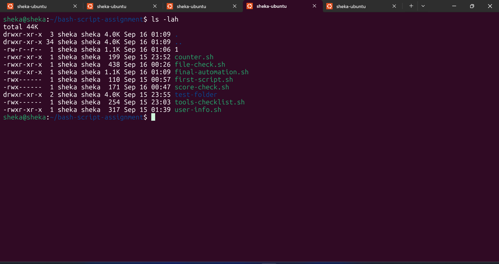

---

### Notes

Answer the following in your own words:

**1. What is a function in Bash?**

A function is a name given to a group of commands that performs a specific task. 

---

**2. Why are functions useful in scripts?**

Helps to group commands into reusable tasks. 

---

**3. Which functions did you create in this script?**

Check_files
print_tools

---

**4. How does this final script combine variables, arrays, loops, conditionals, files, and functions?**

Variables store information 
 Arrays store groups 
Loops repeat work 
Conditionals make decisions 
File tests check things 
Functions organize and reuse the work. 

---

# LinkedIn Post (Required)

## Evidence

#### LinkedIn Post URL

https://lnkd.in/p/d5M43yNJ

---

#### Screenshot — Published LinkedIn post

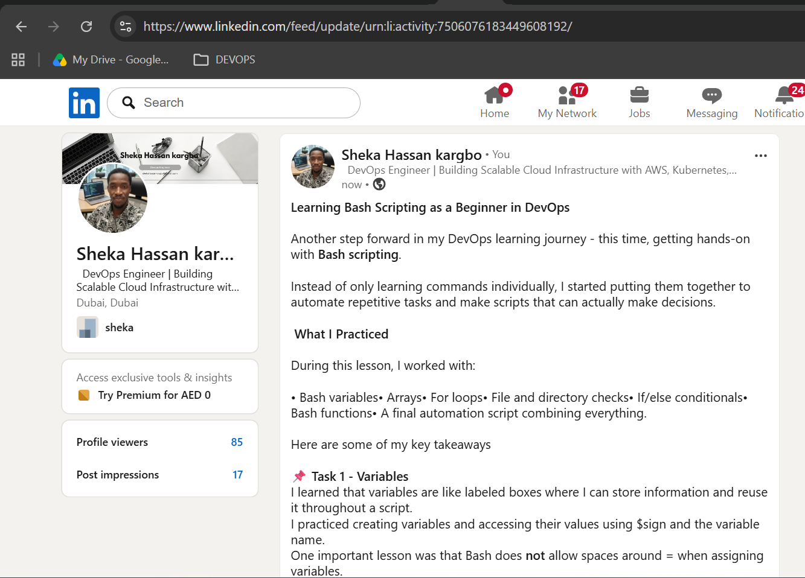

---

# Submission Instructions

- Add all required screenshots in your submission
- Full name must be visible in required screenshots
- All script files must be created and run successfully
- Required notes must be answered clearly for every task
- Do not expose sensitive information (keys, passwords, credentials)

---

# Completion Checklist

- [ ] Task 1: Environment setup verified, workspace created (Screenshots 1–2, Notes answered)
- [ ] Task 2: First script created, executed, permissions verified (Screenshots 1–3, Notes answered)
- [ ] Task 3: Variables script created and run (Screenshots 1–2, Notes answered)
- [ ] Task 4: Arrays and loops script created and run (Screenshots 1–2, Notes answered)
- [ ] Task 5: Counter loop script created and run (Screenshots 1–2, Notes answered)
- [ ] Task 6: File validation script created and run (Screenshots 1–3, Notes answered)
- [ ] Task 7: Pass/Retry conditional script tested with both values (Screenshots 1–4, Notes answered)
- [ ] Task 8: Final automation script created and run (Screenshots 1–3, Notes answered)
- [ ] All scripts run without errors
- [ ] Full Name visible in all required screenshots
- [ ] LinkedIn post published and URL submitted
- [ ] No sensitive data exposed

---

## 📌 About DMI & CloudAdvisory

DevOps Micro Internship (DMI) is a project-based DevOps program run by Pravin Mishra (The CloudAdvisory) focused on real-world execution, systems thinking, and career readiness.

It helps learners build strong DevOps foundations with hands-on experience.

---

## 📌 Resources

- 🌐 DMI Official Website: https://dmi.pravinmishra.com?utm_source=github&utm_medium=readme  
- 🎓 University: https://university.pravinmishra.com?utm_source=github&utm_medium=readme  
- 💬 Discord Community: https://discord.pravinmishra.com?utm_source=github&utm_medium=readme  
- 📝 Blog: https://dmi.pravinmishra.com/blog?utm_source=github&utm_medium=readme  
- ▶️ YouTube Playlist: https://www.youtube.com/playlist?list=PLFeSNDtI4Cho  
- 🔗 Pravin Mishra (LinkedIn): https://www.linkedin.com/in/pravin-mishra-aws-trainer/  
- 🏢 CloudAdvisory (LinkedIn): https://www.linkedin.com/company/thecloudadvisory/

---

*This submission is part of DevOps Micro Internship (DMI) Cohort 3 — Agentic AI Track.*